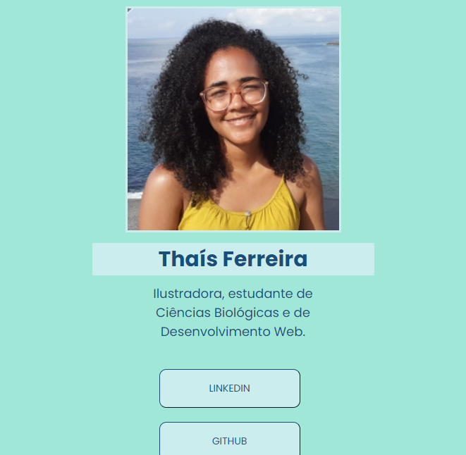

# Meus Links Pessoais

## Descrição do Projeto
Página Web contendo meus links pessoais, desenvolvida durante um encontro da formação 'O Poder do Futuro' da PretaLab em parceria com a Disney.

## O que aprendi
* Durante o desenvolvimento desse projeto eu aprendi a organizar o código HTML em seções e divisões utilizando ``` <section> ``` e ``` <div> ```, e com marcações de classes, que facilitaram o processo de estilização da página em CSS. 

* a organizar as imagens utilizadas numa pasta chamada "assets".

* aprendi também a fazer links na forma de botões clicáveis, adicionando os botões dentro das tags ``` <a> ```:
```
<a href="https://www.linkedin.com/in/thaisferreirasantos/" target="_blank">
    <button class="botao">Linkedin</button>
</a>
```

* a colocar ícones na janela da página, com o seguinte código:
```
<link rel="shortcut icon" href="./assets/thais.png"/>
```

* a fazer um botão de contato que leva diretamente a um programa para envio de email para mim:
```
<a href="mailto:ilustratf@gmail.com" target="_blank">
    <button class="botao">Contato para Ilustrações</button>
</a>
```
* e aprendi a centralizar e formatar todos os botões criados no CSS, com a criação da classe "botao":
```
.botao {
    color: #184e77;
    border-radius: 10px;
    cursor: pointer;
    padding: 16px 45px;
    text-align: center;
    text-transform: uppercase;
    background-color: rgb(204, 237, 238);
    width: 200px;
    margin: 10px;
    font-size: 14px;
    border-color: #184e77;
    border-width: 1px;
}
```

## Resultado Final!
E foi assim que minha página com meus links pessoais ficou:

